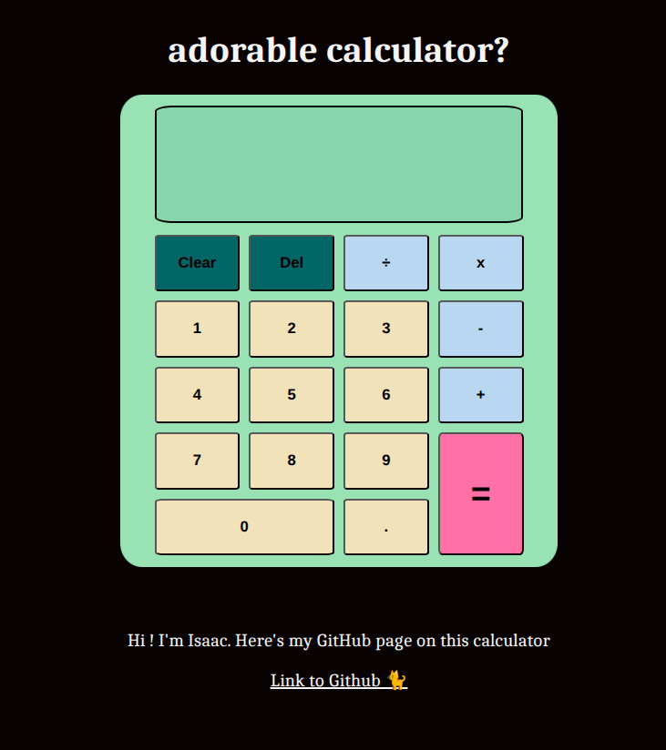

# calculator

Web Based calculator (with Keyboard support)

Try it here: https://isaacfhu.github.io/calculator/

Hi ! I started working on this as part of Odin Project's Foundations Curriculum. This one specifically is the Calculator part (https://www.theodinproject.com/lessons/foundations-calculator) but I then decided to continue playing around with it and polish it.

This project was also made during Macondo's Hackclub period and so I made my journals there!
My Journals on it : https://macondo.hackclub.com/projects/9661

